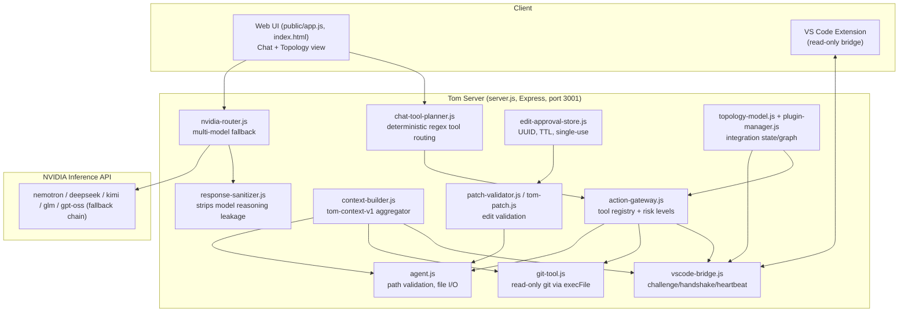
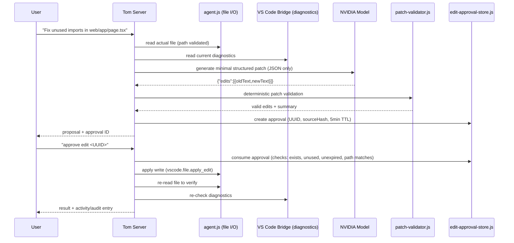
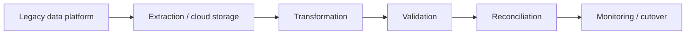

# Tom

**Tom is an AI-powered engineering orchestration platform** — a control layer that lets AI reason about your codebase and project state while deterministic, auditable tooling performs every actual read, write, and integration, with a human approving anything consequential.

> **Status:** Working proof of concept. A local Node.js server orchestrates a single target project ("Drop") through a VS Code bridge, deterministic Git/file tools, and an AI-assisted patch-approval workflow. Enterprise integrations (GitHub, Jira, Databricks, cloud, CI/CD, monitoring) are designed as a plugin architecture but are **not yet functionally connected** — see [Section 20](#20-current-poc-status) for the full status matrix.

---

## Table of Contents

1. [Executive Overview](#1-executive-overview)
2. [Problem Tom Solves](#2-problem-tom-solves)
3. [Why Tom Exists](#3-why-tom-exists)
4. [Product Vision](#4-product-vision)
5. [Who Tom Is For](#5-who-tom-is-for)
6. [Core Design Philosophy](#6-core-design-philosophy)
7. [Current Tom Architecture](#7-current-tom-architecture)
8. [Current End-to-End Workflow](#8-current-end-to-end-workflow)
9. [Security Model](#9-security-model)
10. [Project Context System](#10-project-context-system)
11. [Integration Architecture](#11-integration-architecture)
12. [Major Use Cases](#12-major-use-cases)
13. [Enterprise Use Case](#13-enterprise-use-case)
14. [Example: Large Data Migration](#14-example-large-data-migration)
15. [Tom vs Traditional AI Coding Assistants](#15-tom-vs-traditional-ai-coding-assistants)
16. [AI Strategy](#16-ai-strategy)
17. [Observability & Metrics Architecture](#17-observability--metrics-architecture)
18. [Deployment Model](#18-deployment-model)
19. [Business Value](#19-business-value)
20. [Current POC Status](#20-current-poc-status)
21. [Current Limitations](#21-current-limitations)
22. [Roadmap](#22-roadmap)
23. [Interview Explanation](#23-interview-explanation)
24. [Interview Questions & Answers](#24-interview-questions--answers)
25. [Terminology](#25-terminology)

---

## 1. Executive Overview

Tom is designed to be an **engineering control plane**: a single place where a developer (or eventually a whole engineering organization) can ask questions and request changes across the tools they use every day, without losing context by switching between VS Code, terminals, Git, ticketing systems, dashboards, and cloud consoles.

Tom's core idea is a strict separation of responsibilities:

- **AI handles reasoning** — understanding requests, reading context, proposing changes.
- **Deterministic tools handle execution** — reading files, running Git commands, validating and applying patches.
- **Humans approve consequential actions** — nothing that mutates a real file or system happens without an explicit, expiring, single-use approval.

Today this is implemented as a local Node.js/Express server (`workspace/server.js`) paired with a VS Code extension bridge, working against one authorized project directory. The AI layer calls out to NVIDIA-hosted models for reasoning; every file read, Git command, patch validation, and file write is handled by plain deterministic code, not the model.

## 2. Problem Tom Solves

Modern engineering work is fragmented across many disconnected systems:

- **VS Code / IDE** — where code is actually written
- **Git / GitHub** — where history, branches, and reviews live
- **Jira / ticketing** — where work is tracked
- **Databases** — where application state lives
- **Databricks / data platforms** — where data pipelines and analytics run
- **Cloud infrastructure (AWS/Azure/GCP)** — where the system actually runs
- **CI/CD** — where code is built, tested, and deployed
- **Monitoring / observability** — where you learn something is broken
- **Documentation** — where (in theory) institutional knowledge lives
- **AI coding tools** — increasingly another disconnected surface with its own context window

Every time an engineer moves between these tools, they:

- **Lose context** — re-explaining the same problem to a new tool or person
- **Duplicate work** — re-gathering the same file contents, logs, or tickets manually
- **Add operational overhead** — copy-pasting error messages, diffs, and stack traces between systems
- **Pay AI/tool costs repeatedly** — re-sending the same context to multiple assistants that don't share state

Tom's premise is that this fragmentation, not lack of intelligence, is the real bottleneck in most engineering organizations.

## 3. Why Tom Exists

Tom is not "another coding chatbot" or "another AI coding agent." Coding assistants operate inside a narrow loop: *developer ↔ AI ↔ code*. That loop is useful, but it ignores everything else an engineer actually deals with — tickets, infrastructure, data platforms, CI/CD, incidents, and audit requirements.

Tom exists to be the layer **above** individual tools: a place where AI reasoning is combined with deterministic, permissioned access to the full engineering surface — starting with the IDE and Git today, and designed to extend to tickets, data platforms, cloud infrastructure, and monitoring.

## 4. Product Vision

Tom's vision is a **unified, project-aware engineering workspace** that acts as an orchestration and control layer between engineers, AI reasoning, and the tools that actually run the business:

- One place to ask questions about a project's code, history, and state.
- One place where AI-proposed changes are validated and approved before they touch anything real.
- One place where, over time, tickets, data pipelines, cloud resources, and CI/CD status become visible alongside code — without each integration bypassing governance and approval.

## 5. Who Tom Is For

- **Individual developers** — a project-aware assistant that reads real files and diagnostics instead of guessing.
- **Software teams** — shared, auditable patterns for AI-assisted changes instead of ad-hoc copy-pasting into chat tools.
- **Data engineers** — (planned) a control layer over data platforms like Databricks, so AI can reason about pipelines without being trusted to run them unsupervised.
- **Platform / DevOps teams** — (planned) visibility and controlled action across cloud infrastructure and CI/CD.
- **Production support** — a single place to gather diagnostics, Git state, and logs when triaging an issue.
- **Engineering managers** — visibility into what AI is doing on a project, and an approval boundary they can trust.
- **Enterprises** — (planned) a governance layer for AI-assisted engineering that can be audited, scoped, and controlled per project.

## 6. Core Design Philosophy

Tom's architecture is built on one repeated rule:

- **AI → reasoning** (understanding intent, drafting a patch, explaining a diff)
- **Deterministic systems → execution** (reading files, running Git, validating patches, writing files)
- **Human → authorization** for anything that changes real state

```
User Intent
   ↓
Tom
   ↓
Project Context
   ↓
AI Reasoning
   ↓
Deterministic Action Gateway
   ↓
Approval / Security
   ↓
Engineering Tool
   ↓
Verification
   ↓
Metrics / Audit
```

Today this pipeline is fully implemented for **VS Code file reads/edits and read-only Git operations**. The "Metrics / Audit" stage exists only as in-memory activity tracking today (see [Section 17](#17-observability--metrics-architecture)), not persistent audit logging.

## 7. Current Tom Architecture

The diagram below reflects what actually exists in `workspace/` today.



Major components (all found in `workspace/`):

- **Tom server** (`server.js`) — Express app exposing `/chat`, `/context`, `/project`, `/file`, `/analyze-file`.
- **NVIDIA AI routing** (`nvidia-router.js`) — tries a fixed ordered list of hosted models, falling back on failure; strips chain-of-thought via `chat_template_kwargs.thinking:false`.
- **VS Code bridge** (`vscode-bridge.js` + local extension) — a challenge/nonce handshake, then a 3-second heartbeat that reports workspace folders, active file, diagnostics, and recent file-save events. **No file contents are ever sent by the extension.**
- **Action Gateway** (`action-gateway.js`) — the single registry of callable tools, each tagged with a `riskLevel` (`read` or `approved_write`); anything else is rejected.
- **Project authorization / security boundary** (`agent.js`) — a single hardcoded authorized project root; every path is resolved and checked before any I/O.
- **Project context builder** (`context-builder.js`) — aggregates workspace tree, diagnostics, Git status/diff, and selected files into one `tom-context-v1` payload.
- **File read** (`agent.readProjectFile`) — enforced size limit (1 MB) and path validation.
- **Diagnostics** — sourced from the VS Code bridge heartbeat (lint/compile errors and warnings).
- **Git tools** (`git-tool.js`) — `status`, `branch`, `log`, `diff`, run via `execFile` (no shell), read-only.
- **Patch generation** — the AI model is prompted to return strict JSON `{ edits: [{oldText, newText}] }`, nothing else.
- **Patch validation** (`patch-validator.js`, `tom-patch.js`) — deterministic checks: edit count, size limits, exact-once match of `oldText`, no overlaps, non-empty result.
- **Approval system** (`edit-approval-store.js`) — UUID approval IDs, 5-minute TTL, single-use, source-hash based stale-edit detection.
- **Controlled file writes** — the *only* write-capable tool is `vscode.file.apply_edit`, gated behind a consumed approval.
- **Post-write verification** — the file is re-read after write; diagnostics and activity state are refreshed.

## 8. Current End-to-End Workflow

Example: **"Fix the unused imports in `web/app/page.tsx`. Do not modify anything until I approve."**



What's AI vs. deterministic:

| Step | Mechanism |
|---|---|
| Understanding the request, drafting the patch | **AI** (NVIDIA model, constrained to JSON-only output) |
| Reading the file, resolving the path | **Deterministic** (`agent.js`) |
| Reading diagnostics | **Deterministic** (VS Code bridge heartbeat data) |
| Validating the patch (counts, sizes, uniqueness, overlaps) | **Deterministic** (`patch-validator.js`) |
| Creating/consuming the approval | **Deterministic** (`edit-approval-store.js`) |
| Writing the file | **Deterministic** (only after a valid, unexpired, single-use approval) |
| Re-reading/verifying the result | **Deterministic** |

## 9. Security Model

Protections that exist in the code today (`agent.js`, `vscode-bridge.js`, `edit-approval-store.js`, `patch-validator.js`, `git-tool.js`):

- **Authorized project root** — a single hardcoded project directory; the client cannot redirect Tom elsewhere.
- **Path traversal prevention** — every path is resolved with `path.resolve()` and checked to stay under the authorized root.
- **Blocked files/directories** — `.git`, `.env*`, `node_modules`, `.vercel`, `.next`, `dist`, `build`, `coverage`, and similar are blocked by name at every path segment.
- **Blocked extensions** — `.pem`, `.key`, `.p12`, `.pfx` are rejected outright.
- **Symlink protection** — symlinked entries are detected and not followed during directory listing.
- **File-size limits** — 1 MB cap on file reads; 20 KB cap per patch edit; 20 edits max per patch.
- **Action Gateway** — a single tool registry; any tool not explicitly registered with `read` or `approved_write` is rejected.
- **Tool risk levels** — every tool is explicitly `read` or `approved_write`; only one tool (`vscode.file.apply_edit`) can write, and only with a valid approval.
- **Minimal patches** — the model is constrained to `oldText`/`newText` edits, not full-file rewrites.
- **Explicit approval** — no write happens without a human sending an approval message containing the approval UUID.
- **Expiring approval IDs** — approvals expire after 5 minutes.
- **Single-use approval** — an approval is marked `used` and cannot be replayed.
- **Source hashing / stale-edit detection** — the approval stores a hash of the original file content so a changed file invalidates the pending patch.
- **Post-write verification** — the file is re-read after the write to confirm the applied state.
- **Git operations run via `execFile`** with fixed argument arrays (no shell interpolation, no injectable arguments).
- **No file contents leave the editor** unless explicitly requested through the read tools — the VS Code bridge heartbeat only ever reports paths, diagnostics, and event metadata.

Known gaps (not yet implemented — see [Section 21](#21-current-limitations)): no authentication on the HTTP API, no rate limiting, in-memory (non-persistent) approval store, no persistent audit log.

## 10. Project Context System

`context-builder.js` implements **`tom-context-v1`**, a single aggregated payload the AI can reason over. On a `/context` request, Tom gathers (in parallel, each with independent size limits):

- **Workspace tree** — a filtered file/folder listing (max ~500 entries)
- **Selected files** — up to 10 explicitly requested files, each truncated to ~4000 characters
- **Diagnostics** — current VS Code errors/warnings (max ~200 entries)
- **Git status** — porcelain status output
- **Git diff** — unstaged diff output

This matters because language models have no persistent memory of a project. Without a structured, bounded snapshot of what the workspace actually looks like right now, the model would either hallucinate file contents or require the user to paste everything manually. `tom-context-v1` gives the model a consistent, size-bounded, machine-readable view of project state on every request, gathered by deterministic code rather than by asking the model to "go look."

## 11. Integration Architecture

**CURRENT (implemented and working):**

- VS Code (via the local read-only bridge extension: diagnostics, active file, file-save events, workspace tree)
- Git (local, read-only: status, branch, log, diff)
- NVIDIA-hosted LLMs (chat/reasoning + patch generation)

**PLANNED (declared as plugin manifests only — no live API calls exist yet):**

- GitHub / GitLab / Bitbucket
- Jira / Notion / project management tools
- Databricks and other data platforms
- Azure, AWS, GCP, Oracle Cloud
- Managed databases (PostgreSQL, MongoDB, and others)
- CI/CD (GitHub Actions, Jenkins, GitLab CI)
- Monitoring/observability (DataDog, New Relic, Prometheus)
- Communication tools (Slack, Teams, Discord)
- Other enterprise tools (Vault, Auth0, Stripe, Shopify, etc.)

The `workspace/plugins/manifests/` directory currently declares ~33 categories of tools with metadata (name, vendor, category, declared capabilities), each capability explicitly marked `executable: false`, and each plugin `installed: false` / `enabled: false`. This is a **schema for future integrations**, not a working connector. No credentials for any of these systems exist in the current environment configuration.

## 12. Major Use Cases

These describe intended workflows. Only the **Software Engineering** use case is actually implemented end-to-end today; the others describe the direction the architecture is designed to support once the corresponding plugin integrations exist.

### Software Engineering *(implemented)*
Ask Tom to explain a file, summarize a diff, or propose a minimal patch; review the proposal; approve it; Tom applies and verifies the change.

### Data Engineering *(planned)*
Ask Tom to explain a Databricks pipeline's recent failures, gather logs and job history, and propose a fix — with the actual pipeline change still requiring a controlled, approved action once a Databricks connector exists.

### Production Support *(planned)*
Ask Tom to correlate an incident with recent Git changes, current diagnostics, and (future) monitoring data, producing a single triage summary instead of manually gathering it from five tools.

### Cloud/DevOps *(planned)*
Ask Tom to explain the current state of a CI/CD pipeline or cloud resource, with any state-changing action routed through the same Action Gateway/approval model used for file edits today.

### Large Data Migration *(planned, see Section 14)*
Use Tom as the reasoning and tracking layer across the phases of a legacy-to-cloud data migration.

### Enterprise Engineering Operations *(planned)*
Use Tom's topology view and (future) audit trail as a map of which tools, projects, and approvals are active across a team.

### Individual Developer Workspace *(implemented)*
A single project-aware chat and topology UI (`public/app.js`, `public/topology.js`) that reflects the developer's own VS Code session in real time.

## 13. Enterprise Use Case

An enterprise could use Tom as a governed layer between engineers/AI and the systems they touch:

- **RBAC** — *(planned)* the topology model already has an `authorization` field reserved for role/allowed-actions data, but no role provider exists yet.
- **Controlled integrations** — the plugin manifest system is designed so every integration declares its capabilities and risk level up front, before any connector is enabled.
- **Project boundaries** — already enforced today: a single authorized project root per Tom instance, with path validation on every operation.
- **Approval workflows** — already enforced today for file writes; the same UUID/TTL/single-use pattern is the intended model for any future state-changing integration (e.g., merging a PR, deploying a pipeline).
- **Auditability** — *(partial)* an in-memory activity tracker exists today (operation start/complete/fail with timestamps), but there is no persistent audit log yet.
- **Company-specific context** — the `tom-context-v1` system is designed to extend beyond a single VS Code workspace to org-specific context sources.
- **Observability** — *(planned)* see [Section 17](#17-observability--metrics-architecture).

## 14. Example: Large Data Migration

Conceptually, Tom could support a large migration such as moving a legacy data platform to a modern cloud/data platform, structured through the same reasoning/execution/approval pipeline:



In this vision, Tom would help engineers reason about each phase (what's been migrated, what's failing validation, what reconciliation reports show) while every actual data-moving operation remains a deterministic, approved, auditable action — never an autonomous AI action.

**This is not implemented today.** Tom currently has no Databricks, cloud storage, or data-platform connectors. This section describes intended architecture only.

## 15. Tom vs Traditional AI Coding Assistants

Traditional coding assistant:

```
Developer ↔ AI ↔ Code
```

Tom's architectural direction:

```
Developer
   ↕
  Tom
   ↕
Code + Git + Tickets + Data + Cloud + CI/CD + Runtime + Monitoring
```

Coding assistance is one capability inside the broader Tom architecture, not the whole product. Today, Tom's implemented surface (VS Code + Git) looks similar in scope to a coding assistant; the architectural difference is that **every action already goes through a deterministic gateway and approval step**, and the same gateway is designed to extend to non-code systems as connectors are built — rather than each new integration reinventing its own trust model.

## 16. AI Strategy

Tom deliberately does **not** use AI for every operation. AI is used only where reasoning has genuine value: understanding a request, summarizing a diff, drafting a minimal patch, explaining diagnostics.

Everything else is deterministic:

- File operations (reads, writes) — plain Node.js `fs` calls behind path validation
- Git state — `execFile` with fixed arguments
- Validation — pure functions checking counts, sizes, uniqueness, overlaps
- Permissions — a static tool registry with explicit risk levels
- Approvals — UUID + TTL + single-use bookkeeping
- Metrics — timestamped operation records

This split gives concrete advantages:

- **Cost** — deterministic operations are free and instant; AI calls are only made when reasoning is actually required.
- **Reliability** — a regex-based tool planner and a hand-written validator behave the same way every time; an LLM asked to "decide what to do" does not.
- **Security** — a model can *propose* a patch, but it can never *apply* one; only code with explicit path/size/approval checks can write.
- **Reproducibility** — the same input always produces the same validation result, which matters for anything approaching an audit trail.

## 17. Observability & Metrics Architecture

**Planned.** Today, Tom has an in-memory `activity-tracker.js` (operation start/complete/fail, bounded to the last 50 events per project) and a `topology-model.js` snapshot that shows connected plugins and their state in the UI. There is no persistent metrics store, no historical graphing, and no cost/token accounting yet.

The intended architecture is a Metrics landing page leading to separate modules:

- **Deterministic Activity** — a durable version of today's in-memory activity tracker
- **Development Metrics** — code changes, patches, approvals over time
- **Runtime Metrics** — application health signals from connected systems
- **Infrastructure / On-Prem Metrics** — cloud/on-prem resource telemetry
- **Analytics** — cross-cutting reporting

Planned capabilities under this architecture: live metrics, logs, graphs, heat maps, project activity feeds, infrastructure telemetry, application health, AI/tool usage and cost/token metrics, and persistent audit history. **None of this is implemented today beyond the bounded in-memory activity tracker and topology snapshot.**

## 18. Deployment Model

**Currently implemented:** local developer deployment only — `node server.js` run on a developer's machine, talking to a single authorized project directory on the same filesystem, with a VS Code extension run in development mode (`--extensionDevelopmentPath`) against the same machine.

**Planned, not implemented:**
- Enterprise/private cloud deployment (multi-project, multi-user, with authentication)
- On-prem deployment for organizations that cannot send code/context to a hosted AI API

## 19. Business Value

In simple terms, if the planned architecture is realized, Tom could:

- Reduce tool fragmentation by giving engineers one place to reason across systems
- Reduce repetitive engineering work (re-explaining context to each tool)
- Preserve project context across a session instead of re-gathering it manually
- Control AI usage through a deterministic gateway instead of letting a model act unsupervised
- Reduce unnecessary AI/API consumption by only invoking models where reasoning is genuinely needed
- Improve governance through explicit approval and (planned) audit trails
- Centralize engineering visibility through a topology/activity view

No ROI figures are claimed here; this is a description of intended value, not a measured outcome.

## 20. Current POC Status

| Capability | Status | Description |
|---|---|---|
| Chat API (`/chat`) | IMPLEMENTED | Tool planning → model call → sanitization → response |
| NVIDIA multi-model routing | IMPLEMENTED | Ordered fallback across ~7 hosted models |
| VS Code bridge (handshake/heartbeat) | IMPLEMENTED | Challenge/nonce handshake, 3s heartbeat, diagnostics/active-file/save-events only |
| Path validation & project boundary | IMPLEMENTED | Single authorized root, traversal/symlink/extension/size checks |
| Read-only Git tools | IMPLEMENTED | `status`, `branch`, `log`, `diff` via `execFile` |
| Project context builder (`tom-context-v1`) | IMPLEMENTED | Tree, diagnostics, git status/diff, selected files |
| Patch validation | IMPLEMENTED | Count/size/uniqueness/overlap checks, JSON-only model output |
| Edit approval workflow | IMPLEMENTED | UUID, 5-min TTL, single-use, source-hash stale detection |
| Controlled file writes | IMPLEMENTED | Only `vscode.file.apply_edit`, gated on a consumed approval |
| Action Gateway / tool registry | IMPLEMENTED | Static registry with `read` / `approved_write` risk levels |
| Response sanitization | IMPLEMENTED | Strips leaked model reasoning/chain-of-thought |
| Topology visualization (UI) | IMPLEMENTED | SVG graph of project/plugin nodes and edges, pan/zoom/persist |
| Activity tracking | IMPLEMENTED | In-memory operation lifecycle, bounded to last 50 events |
| Plugin manifest system | PARTIAL | ~33 categories of metadata declared; no connectors execute |
| Plugin state management | PARTIAL | Install/enable/disable bookkeeping; only VS Code connector is live |
| GitHub / Jira / Databricks / cloud integrations | PLANNED | Manifest metadata only, `executable: false` |
| Authentication on HTTP API | PLANNED | No auth currently on `/chat`, `/file`, `/context` |
| Persistent audit log | PLANNED | Only in-memory, non-persistent activity tracking exists |
| RBAC / role provider | PLANNED | `authorization` field reserved in topology schema, unpopulated |
| Metrics/observability modules | PLANNED | See Section 17 |
| Multi-project / multi-user support | PLANNED | Single hardcoded project root today |

## 21. Current Limitations

Tom **cannot currently**:

- Authenticate or authorize API callers — any local client can call `/chat`, `/file`, or `/context`.
- Rate-limit requests.
- Persist approvals across a server restart (the approval store is in-memory).
- Maintain a persistent, tamper-evident audit log of applied changes.
- Operate against more than one project/root at a time (the authorized project root is hardcoded).
- Connect to GitHub, Jira, Databricks, AWS, Azure, GCP, or any database/CI/CD/monitoring system — these exist only as declarative manifests.
- Enforce role-based access control — no role provider exists.
- Run outside a single developer's local machine — there is no hosted, multi-tenant, or on-prem deployment yet.
- Autonomously execute a data migration, deployment, or any multi-step operation without per-step human approval.
- Guarantee model availability — the NVIDIA fallback chain reduces but does not eliminate the risk of all providers failing simultaneously.
- Test its own AI fallback behavior — there are currently no automated tests covering the multi-model fallback path or full end-to-end chat flow.

## 22. Roadmap

**Phase 1 — Local Engineering Control Plane** *(current state)*
VS Code bridge, deterministic Git tools, patch validation, approval workflow, topology UI — all implemented against a single local project.

**Phase 2 — Live Engineering Integrations**
Wire the first real connectors (e.g., GitHub, one database) behind the existing Action Gateway and approval model, replacing manifest metadata with executable capabilities.

**Phase 3 — Metrics & Observability**
Replace in-memory activity tracking with a persistent store; build the Metrics landing page and its sub-modules (Deterministic Activity, Development, Runtime, Infrastructure, Analytics).

**Phase 4 — Enterprise Integrations**
Add authentication, multi-project support, and additional connectors (Jira, Databricks, cloud providers, CI/CD, monitoring).

**Phase 5 — Enterprise Orchestration**
RBAC, persistent audit trails, multi-user/multi-tenant deployment, and governance features suitable for enterprise engineering organizations.

## 23. Interview Explanation

### 30-second explanation
"Tom is an AI engineering orchestration platform. The AI reasons about your project — reading files, diagnostics, and Git state — and proposes changes, but it can never apply them directly. Every proposed change goes through deterministic validation and requires an explicit, single-use, expiring approval before anything is written. Today it works end-to-end for VS Code and Git; it's architected to extend to tickets, data platforms, cloud, and CI/CD as separate governed integrations."

### 2-minute explanation
"Most AI coding tools are a tight loop: you talk to a model, and it edits your code. That's useful, but it doesn't scale to how engineering actually works — you're also dealing with Git, tickets, data pipelines, cloud infrastructure, and monitoring, and none of those tools share context with each other or with the AI.

Tom is built around a strict separation: AI only reasons and proposes; deterministic code executes; a human approves anything that changes real state. Concretely, when you ask Tom to fix something, it reads the actual file and current diagnostics through a VS Code bridge, sends that context to a model constrained to return a minimal JSON patch, then runs that patch through a validator that checks it's safe — no duplicate matches, no overlaps, no oversized edits. If it's valid, Tom creates an approval with a UUID, a 5-minute expiry, and a hash of the original file so it can detect if the file changed in the meantime. Only after you explicitly approve does Tom write the file, and then it re-reads it to verify.

Right now that pipeline is fully built for VS Code and read-only Git operations. The bigger architecture — the same gateway and approval model extending to GitHub, Jira, Databricks, cloud infrastructure, and CI/CD — exists as a plugin manifest schema today, not as working integrations. I built it this way deliberately: I wanted the trust model (deterministic execution + explicit approval) proven and tested before wiring up systems that can do real damage."

### Technical architecture explanation
"The server is a single Express app. Requests flow through a deterministic tool planner (regex-based, not model-based) that decides which read-only tools to call — Git status/log/diff, or VS Code file/diagnostic reads — and aggregates that into a bounded context object before calling the model. The model only ever gets asked to do two things: converse, or return a strict JSON patch. Patches never get applied directly; they go through a validator that checks structural safety (unique match, no overlaps, size limits), then get stored behind a UUID-keyed approval with a TTL, single-use flag, and a hash of the source file. The only tool in the entire registry marked `approved_write` is the file-apply tool, and it refuses to run without a matching, unexpired, unused approval. Every tool call is logged through an activity tracker that feeds a topology visualization showing what's connected and what's currently running."

## 24. Interview Questions & Answers

**What is Tom?**
An AI engineering orchestration platform where AI proposes changes and deterministic code executes and validates them, with human approval required for anything that writes to a real system.

**Why did you build it?**
To separate AI reasoning from execution so that AI-assisted engineering work is safe, auditable, and governable — instead of trusting a model to directly modify files or systems.

**What problem does it solve?**
Engineering context fragmentation across IDEs, Git, tickets, data platforms, cloud, CI/CD, and monitoring, plus the risk of letting AI act on systems without a controlled approval boundary.

**Why not just use GitHub Copilot?**
Copilot-style tools operate in a developer ↔ AI ↔ code loop inside the editor. Tom is designed as a layer above that: a gateway that any AI reasoning can go through, with the same approval and validation model intended to extend beyond code to tickets, data, and infrastructure.

**Where is AI used?**
Understanding user requests, summarizing diffs/diagnostics, and drafting minimal JSON patches. The model is deliberately constrained — it never receives write access.

**Where is deterministic execution used?**
File reads/writes, Git commands, patch validation, approval lifecycle management, and tool routing — all plain code with explicit checks, no model involved.

**How do you prevent AI from directly modifying files?**
The only write-capable tool in the Action Gateway (`vscode.file.apply_edit`) requires a valid, unexpired, unused approval ID that was created from a deterministically validated patch. The model itself has no file-system access.

**How does approval work?**
A proposed patch is validated, then stored with a UUID, a 5-minute expiry, a single-use flag, and a hash of the original file content. The user replies with the approval ID; Tom checks all four conditions before writing, then invalidates the approval.

**How does Tom understand the project?**
Through `tom-context-v1`: a bounded aggregation of the workspace file tree, current diagnostics, Git status/diff, and any explicitly requested file contents, built by deterministic code and passed to the model as context.

**How is security handled?**
A single authorized project root with path traversal, symlink, blocked-name, blocked-extension, and size-limit checks; a static tool registry with explicit risk levels; and an approval workflow for the one tool that can write.

**What have you actually implemented?**
The full read/reason/propose/validate/approve/write/verify pipeline for VS Code and read-only Git, plus a topology UI and in-memory activity tracking.

**What is still planned?**
Live integrations for GitHub, Jira, Databricks, cloud providers, CI/CD, and monitoring; authentication and RBAC; a persistent audit log; multi-project/multi-user deployment; and a full metrics/observability suite.

**How could an enterprise use Tom?**
As a governed control layer where engineers and AI both operate through the same Action Gateway and approval model, giving the organization one place to see and control what's happening across projects — once the corresponding integrations, auth, and audit features are built.

**How would Tom scale?**
By generalizing the current single-project, single-user model to multi-project, multi-user deployment with authentication, persistent storage for approvals/activity, and per-project role-based permissions.

**What was the hardest architectural problem?**
Keeping the model fully out of the execution path — constraining it to a narrow, validated output format (`oldText`/`newText` edits) rather than letting it touch files, so that every guarantee about safety comes from code, not from trusting model behavior.

**What would you build next?**
Authentication on the HTTP API and a persistent audit log, since those are prerequisites for any real integration beyond a single trusted local developer.

## 25. Terminology

- **Action Gateway** — the single registry of callable tools in `action-gateway.js`; every tool has a declared risk level (`read` or `approved_write`) and unregistered tools cannot be invoked.
- **Project Context** — the `tom-context-v1` payload aggregating workspace tree, diagnostics, Git state, and selected files for AI reasoning.
- **VS Code Bridge** — the challenge/handshake/heartbeat protocol between the Tom server and a local VS Code extension that reports diagnostics, active file, and save events (never file contents).
- **Deterministic execution** — any operation performed by plain code with fixed, testable logic (file I/O, Git commands, validation) rather than by an AI model.
- **Approval** — a UUID-keyed, time-limited, single-use record created from a validated patch; required before any write can occur.
- **Patch** — a minimal set of `{oldText, newText}` edits describing a proposed file change, validated for uniqueness, size, and non-overlap before it can be approved.
- **Tool** — a named, registered capability in the Action Gateway (e.g., `git.status`, `vscode.file.read`).
- **Capability** — a declared function a plugin/tool can perform, along with its risk level; for planned integrations, capabilities are declared but marked non-executable until a connector is built.
- **Project boundary** — the single authorized root directory that all file operations are validated against; operations outside it are rejected.
